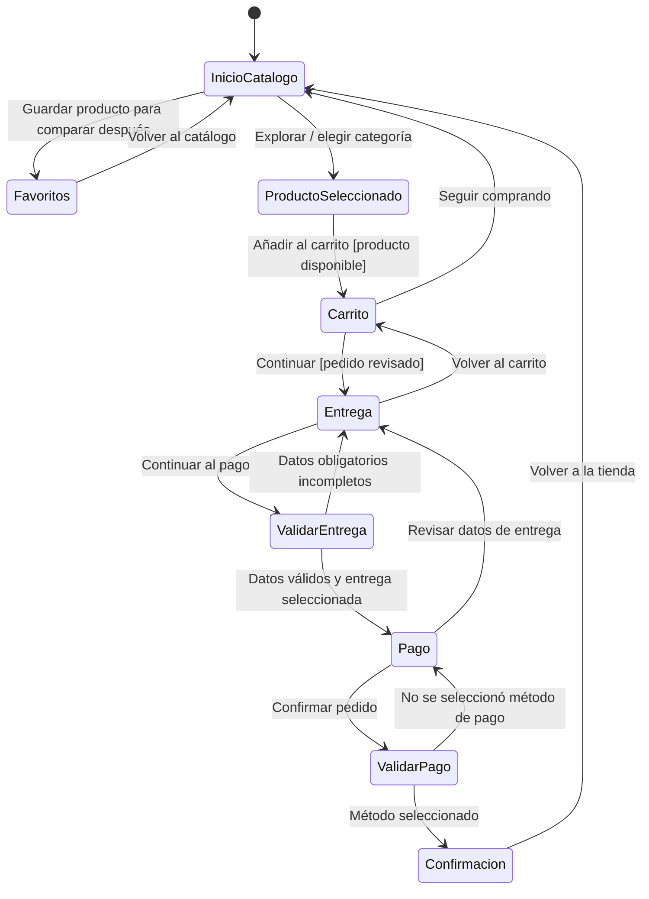

# Apex Sports: guía del prototipo

Esta guía documenta el diseño; no forma parte de las pantallas de la tienda.

## Alcance y decisiones

- Prototipo de baja fidelidad responsive, implementado con HTML semántico, CSS y JavaScript local para la lista de favoritos; sin servicios externos.
- Catálogo demostrativo de 120 artículos (10 por cada una de las 12 categorías: fútbol, basketball, tennis, artes marciales, volleyball, ropa deportiva, running, ciclismo, fitness, natación, outdoor y accesorios). La portada mantiene todas las categorías con carruseles horizontales de 10 productos y una tarjeta final «Ver más»; la vista exclusiva muestra hasta 15 productos por página.
- La tienda y sus imágenes usan diseños fluidos: tarjetas que se adaptan al ancho disponible, imágenes con recorte `object-fit: cover` y controles con un mínimo táctil de 44 × 44 px.
- Paleta limitada a cinco colores: azul profundo `#17324D` (dominante), marfil `#F4F1E8` y terracota `#A84328` (secundarios), gris `#667581` y blanco `#FFFFFF` (complementarios).
- La compra recorre cuatro clics principales: añadir producto, continuar desde el carrito, continuar desde entrega y confirmar pedido.
- El pago y la entrega son simulaciones visuales. No hay cobro, transferencia ni persistencia de pedido real. Los cuatro campos de tarjeta se validan solo en el navegador; no se guardan ni se envían. Transferencia y retiro local muestran guías y datos de ejemplo, cubiertos por un único aviso de simulación en cada pantalla. El retiro local elimina la tarifa de envío y calcula el total como el subtotal. Al confirmar, se guarda el resumen del pedido en la sesión y se vacía el carrito; la confirmación sigue mostrando los productos seleccionados.
- Para completar el recorrido en cuatro acciones principales, el envío estándar y la tarjeta aparecen preseleccionados; se pueden cambiar por envío express, transferencia o pago y retiro local.
- Al seleccionar la imagen o los datos de un artículo se abre una ficha propia con imagen, descripción, precio, selector de cantidad, acción para añadir al carrito y productos relacionados. La cantidad elegida se suma al carrito y puede ajustarse allí; los controles de cantidad son accesibles por teclado y cumplen el mínimo táctil de 44 px.
- Cualquier persona puede guardar artículos en favoritos con el control de corazón y compararlos después desde «Favoritos». La lista se conserva en `localStorage` del mismo navegador y dispositivo; no exige cuenta para esta demostración.
- La lista local se puede perder si se borran los datos del navegador, se usa otro navegador/dispositivo o se cambia el origen del sitio. Una cuenta no es necesaria para guardar en el mismo dispositivo; para recuperar/sincronizar la lista entre dispositivos sí se requiere autenticación y un servicio/backend que la almacene. Eso queda fuera de este prototipo.
- La paginación muestra hasta 15 productos por página en cada categoría y en favoritos; no se muestran controles si no hay más de 15 productos. Si se agregan más, anterior/siguiente no cambia de categoría, y al abrir otra sección se vuelve a su primera página.
- Se consideran aplicadas las heurísticas 1–4, 6–8. La 5 (prevención de errores) se cubre solo parcialmente mediante campos requeridos y confirmación explícita. La 9 (recuperación de errores) y la 10 (ayuda y documentación) quedan fuera de alcance según la consigna; no hay reversión de transacción real ni ayuda contextual.

## Paleta de colores: uso y motivo

| Color | Rol | Dónde se usa | Por qué |
|---|---|---|---|
| Azul profundo `#17324D` | Dominante | Encabezados, texto principal, botones, marca, barra principal y hero. | Comunica confianza y energía deportiva; su contraste con blanco y marfil permite leer texto y reconocer acciones. |
| Marfil `#F4F1E8` | Secundario | Fondos de categorías y tarjetas de producto, detalles y botones claros. | Suaviza la página frente al blanco puro y separa bloques sin recargar la interfaz. |
| Terracota `#A84328` | Secundario | Acentos, etiquetas pequeñas, foco de teclado y llamada visual. | Añade energía y ayuda a destacar acentos sin competir con el azul. El tono oscuro mantiene contraste suficiente sobre fondos claros. |
| Gris `#667581` | Complementario | Texto secundario, metadatos, bordes y descripciones breves. | Diferencia información secundaria conservando legibilidad sobre blanco y marfil. |
| Blanco `#FFFFFF` | Complementario | Fondo general, paneles y texto sobre zonas oscuras. | Mantiene claridad, espacio visual y contraste con el color dominante. |

Los valores hexadecimales de la implementación están centralizados al inicio de `estilos.css` como variables CSS. La paleta no asigna información únicamente mediante color; los controles también tienen texto, etiquetas y foco visible.

## Uso con teclado

Sí: la navegación y los controles usan enlaces, botones, campos y radios HTML nativos; el pequeño JavaScript de favoritos no reemplaza esos controles. Se puede recorrer con teclado:

- **Tab** avanza al siguiente enlace o control; **Shift+Tab** retrocede.
- **Enter** activa enlaces y botones. **Espacio** activa botones y controles de selección; las flechas cambian opciones dentro de un grupo de radios.
- Cada corazón de favorito es un botón accesible con un nombre que identifica el producto, estado `aria-pressed` y anuncio del resultado a lectores de pantalla.
- Los carruseles de portada se pueden desplazar horizontalmente con trackpad, gesto táctil, foco y teclado; sus controles anterior/siguiente son botones accesibles.
- El enlace **Saltar al contenido** aparece al recibir foco. El control activo tiene un contorno de foco visible.
- **Esc** no se necesita para cerrar nada en este prototipo; los detalles de pago se abren y cierran con Enter o Espacio.

La búsqueda filtra los artículos del catálogo. Seleccionar la imagen o los datos de un producto abre su ficha, con imagen, descripción, precio, selector de cantidad, acción para añadir al carrito y recomendaciones relacionadas; **Volver al inicio** regresa a la página principal desde cualquier ficha. Los controles de cantidad permiten definir unidades antes de añadirlas y ajustar el valor desde el carrito. Los controles de añadir y quitar gestionan el carrito de demostración; los botones de corazón guardan y quitan productos de la lista local de favoritos. Las tarjetas de categoría usan iconos SVG dibujados para representar el deporte o equipo relacionado. La portada presenta todas las categorías y sus carruseles horizontales; los botones **Explorar categoría** y la tarjeta final **Ver más** llevan a la misma vista exclusiva. Al entrar en una categoría se oculta el resto de la portada; **Volver a categorías** restaura todas las secciones. La vista exclusiva muestra hasta quince artículos por página y **Anterior/Siguiente** aparece solo si se agregan más de quince; la lista de favoritos también se pagina si supera ese tamaño.

## Ilustraciones de los productos

Cada artículo tiene su propia ilustración SVG original: muestra únicamente el producto sobre un fondo liso, sin personas ni escenas. Las 120 ilustraciones se guardan en `images/products/`, usan texto alternativo y tienen licencia CC BY 4.0. Se pueden regenerar ejecutando `node generar-ilustraciones.js` desde la raíz del proyecto. Son ilustraciones referenciales; no son fotografías oficiales de los modelos comerciales ficticios del prototipo.

Para cambiar la ilustración de un artículo, modifica su registro en `data/products.json` y la regla correspondiente del archivo `generar-ilustraciones.js`; luego ejecuta el generador. Las imágenes locales responden y se muestran sin depender de un servicio externo.

## Flujo de navegación: diagrama de estados

### Puntos de decisión

1. **Producto:** el usuario abre la ficha del producto para revisar su imagen y descripción; puede añadirlo desde esa vista o volver a explorar.
2. **Carrito:** continuar con la compra o volver al catálogo.
3. **Entrega:** los campos requeridos deben ser válidos y debe seleccionarse envío estándar o express. La interfaz informa los campos inválidos.
4. **Pago:** el usuario selecciona tarjeta, transferencia o pago y retiro local. Con tarjeta debe completar los cuatro campos; transferencia muestra una cuenta de ejemplo de Banco Pichincha y retiro local muestra una dirección de ejemplo. El retiro local elimina el costo de envío.
5. **Confirmación:** se muestra el método elegido, los artículos seleccionados y un total ilustrativo; retiro local no suma envío. El carrito se vacía al confirmar, mientras el resumen queda disponible durante la sesión. No se procesa dinero ni se crea un pedido real.

## Secuencia de tareas

### Objetivo: comprar un artículo

1. Explorar el catálogo por deporte o usar búsqueda.
2. Abrir un producto y revisar su ficha y recomendaciones; elegir una cantidad con el campo o los botones −/+, y activar **Añadir al carrito**. Feedback: el contador y el mensaje de estado confirman las unidades añadidas sin salir de la ficha.
3. Revisar subtotal y activar **Continuar con la entrega**.
4. Completar nombre, correo, teléfono, dirección y ciudad; elegir envío estándar (3–5 días) o express (1–2 días). Feedback: validación nativa del navegador si falta un dato.
5. Activar **Continuar al pago**; seleccionar tarjeta, transferencia o pago y retiro local. Para tarjeta, completar los campos; transferencia y retiro muestran instrucciones del método elegido.
6. Activar **Confirmar pedido**. Feedback: la pantalla presenta el método, artículos y total estimado; aclara que no hubo cobro, transferencia ni envío real.

### Objetivo: cambiar el método de entrega o pago antes de confirmar

1. Usar el enlace **Volver al carrito** o **Volver a la entrega** desde el paso actual.
2. Cambiar la opción seleccionada.
3. Avanzar nuevamente y confirmar cuando los datos sean correctos.

### Objetivo: guardar productos para decidir después

1. Activar el botón de corazón en uno o más artículos.
2. Revisar el contador actualizado junto a **Favoritos** y abrir esa lista cuando se quiera comparar.
3. Quitar un producto con su botón de corazón o volver al catálogo para seguir explorando.
4. Los favoritos permanecen en el mismo navegador y dispositivo. Para conservarlos al cambiar de dispositivo, hará falta iniciar sesión en una futura versión conectada a un backend.

### Objetivo: explorar una categoría desde la portada

1. Revisar las categorías disponibles y recorrer el carrusel con gesto horizontal o con sus botones de flecha.
2. Ver hasta diez productos destacados y activar la tarjeta **Ver más** al final, o el enlace **Explorar categoría**.
3. La misma sección exclusiva se abre en ambos casos; allí se recorren hasta 15 artículos por página.

### Objetivo: revisar todos los artículos de una categoría

1. Elegir la categoría en el selector para ir a su sección exclusiva.
2. Ver hasta los primeros quince productos en la vista exclusiva.
3. Activar **Siguiente** para ver los productos restantes o **Anterior** para regresar; el estado indica el número de página y los botones se desactivan al llegar a los extremos.

## Respuesta del sistema / feedback

| Interacción | Feedback |
|---|---|
| Enlace de categoría o producto | Desplazamiento a la categoría o apertura de la ficha del producto con recomendaciones relacionadas. |
| Búsqueda | Envío del término como parámetro de URL; la interfaz no implementa resultados dinámicos. |
| Envío con campos incompletos | Validación nativa del navegador, foco en el primer control inválido y mensaje asociado. |
| Selección de entrega | La opción marcada es visible; en el paso de pago se muestra una entrega de demostración con costo y plazo estimados. |
| Selección de tarjeta | Se validan nombre, número mediante dígito de control, vencimiento y código de seguridad; el primer campo inválido recibe el foco. Los datos no se guardan ni se envían. |
| Selección de transferencia | Aparece una guía y los datos de cuenta de ejemplo de Banco Pichincha; el aviso de simulación indica que no se deben ingresar datos financieros reales. |
| Selección de pago y retiro local | Aparece una guía con ubicación de ejemplo; el costo de envío pasa a $0,00 y el total queda igual al subtotal. |
| Añadir al carrito desde la ficha | El contador del carrito se actualiza y el botón confirma la acción; permanece visible la ficha del producto. |
| Seleccionar cantidad en la ficha | Los controles −/+ y el campo numérico actualizan la cantidad; el carrito recibe las unidades seleccionadas. |
| Agregar o quitar favorito | El corazón cambia entre seleccionado/no seleccionado, se actualiza el contador y se anuncia el nombre del artículo; en la lista se refleja el cambio. |
| Recomendaciones | La ficha presenta hasta seis productos relacionados; seleccionar uno abre su propia ficha. |
| Cambiar página | Se muestran hasta quince productos, cambia el indicador de página y se deshabilita el control que ya no aplica. La paginación solo se muestra cuando hay más de quince productos. |
| Confirmación | Resumen final con identificador, productos y método seleccionados; el carrito se limpia y el resumen permanece disponible durante la sesión. |

## WCAG 2.2: cuatro principios

- **Perceptible:** jerarquía de encabezados, etiquetas visibles, descripciones de los artículos, navegación nombrada, foco visible y contraste alto. Ningún dato importante depende solo del color. Enlaces de salto al contenido.
- **Operable:** controles nativos utilizables con teclado, foco visible, botones y corazones de al menos 44 × 44 px, navegación por páginas y respeto a `prefers-reduced-motion`.
- **Comprensible:** idioma español declarado, formularios con etiquetas, `autocomplete`, tipos de entrada adecuados, requeridos señalados por validación del navegador, pasos de compra y textos de acción explícitos.
- **Robusto:** HTML5 semántico, landmarks, encabezados y controles nativos con nombres accesibles, sin dependencias externas; compatible con navegadores modernos y tecnologías de asistencia.

## Heurísticas de Nielsen consideradas

1. **Visibilidad del estado del sistema:** pasos del checkout, selección de opciones, resumen y confirmación.
2. **Correspondencia con el mundo real:** vocabulario familiar, categorías deportivas, precios, direcciones y plazos cotidianos.
3. **Control y libertad:** regreso a carrito/entrega y volver a la tienda antes o después de la simulación.
4. **Consistencia y estándares:** navegación, botones, formularios y progreso consistentes; controles HTML convencionales.
5. **Prevención de errores (parcial):** campos obligatorios, elección de método y validación de formato de los datos ficticios de tarjeta; el prototipo no valida inventario ni verifica pagos o cuentas bancarias reales.
6. **Reconocer en vez de recordar:** categorías visibles, progreso actual, resumen por etapa y lista de favoritos guardada en el navegador.
7. **Flexibilidad y eficiencia:** acceso por categoría, favoritos para comparar y camino de checkout corto; no hay atajos personalizados.
8. **Diseño estético y minimalista:** contenido comercial prioritario, pantallas de checkout sin elementos promocionales innecesarios.
9. **Ayudar a reconocer, diagnosticar y recuperarse de errores (no implementada):** sin sistema de pedidos o errores del servidor, no se ofrece recuperación contextual.
10. **Ayuda y documentación (no implementada en la interfaz):** se excluye la ayuda contextual; esta guía es documentación del entregable, no contenido de la tienda.
